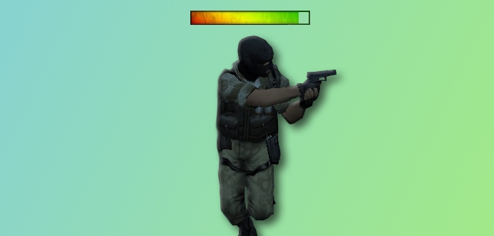
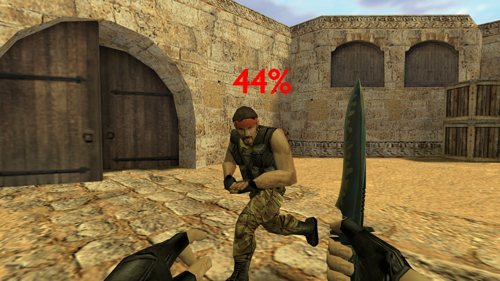

# Deathrun Duel Lifebar

_**English** | [Русский](README.ru.md)_



AMX Mod X plugin for Counter-Strike.

The plugin adds a duel health bar for the Deathrun Mod.

## Configuration
The configuration is done in the source file:
```c
#define COLOR_RED Float: { 255.0, 0.0, 0.0 } // Lifebar color for the terrorist team
#define COLOR_BLUE Float: { 0.0, 0.0, 255.0 } // Lifebar color for the counter-terrorist team
#define LIFEBAR_RENDERMODE kRenderTransTexture
#define LIFEBAR_RENDERAMT 255.0
#define LIFEBAR_SCALE 0.2 // Lifebar size
new const LIFEBAR_MODEL[] = "sprites/next21_efk/lifebar_def.spr" // Lifebar model (sprites/next21_efk/lifebar_numeric.spr for numeric)
```



## Requirements
- [DeathrunMod](https://github.com/Mistrick/DeathrunMod)

## Authors
- [Psycrow](https://github.com/Psycrow101)
